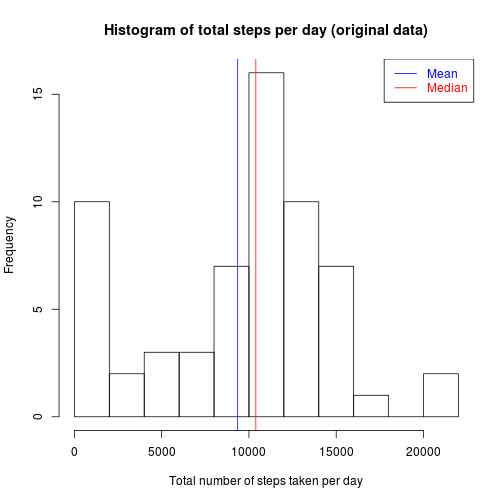
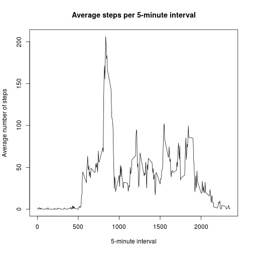
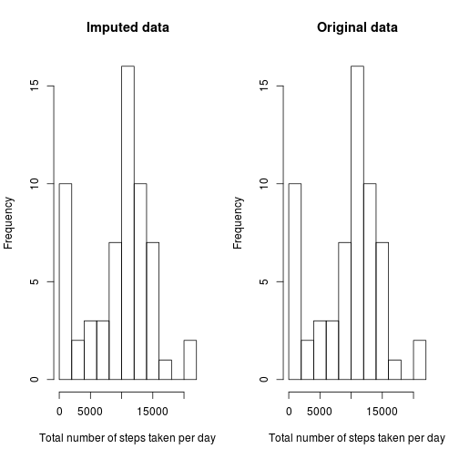
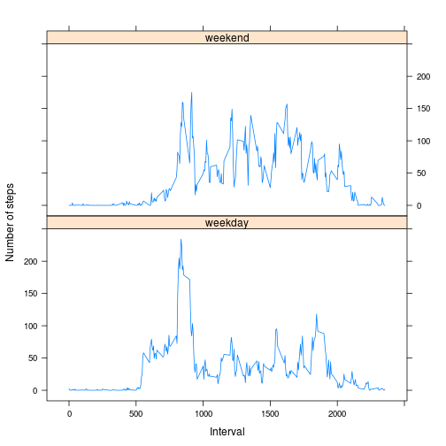

# Reproducible Research: Peer Assessment 1

This assignment makes use of data from a personal activity monitoring
device. The device collects data at 5 minute intervals throughout the
day. The data consists of two months (61 days) of data from an anonymous
individual collected during the months of October and November, 2012
and include the number of steps taken in 5 minute intervals each day.

## Source Data

* Dataset: [Activity monitoring data](https://d396qusza40orc.cloudfront.net/repdata/data/activity.zip) [52K] - included in this repository.

The variables included in the dataset are:

* **steps**: Number of steps taking in a 5-minute interval (missing
    values are coded as `NA`)

* **date**: The date on which the measurement was taken in YYYY-MM-DD
    format

* **interval**: Identifier for the 5-minute interval in which
    measurement was taken

The dataset is stored in a comma-separated-value (CSV) file and there
are a total of 17,568 observations in it --
61 days with exactly 288 observations each.


## Prerequisites: R libraries

The following R libraries are used to process the data


```r
library(dplyr)
library(lubridate)
library(lattice)
```


## Loading and preprocessing the data

The following code

1. If neccessary, extracts the data,
2. loads the data; and
3. parses date values in the _date_ column


```r
zipfile <- "activity.zip"
csvfile <- "activity.csv"

# Ensure the zip file has been extracted
if (!file.exists(csvfile)) unzip(zipfile)

# Load and preprocess the data
data <- csvfile %>%
  read.csv2(sep = ",", na.strings = "NA", colClasses=c("integer", "character", "integer")) %>%
  mutate(date = ymd(date))
```


## What is mean total number of steps taken per day?

This R code extracts the mean and median number of steps taken per day,
ignoring missing values (`NA`s), and produces a histogram plot of total
steps per day.


```r
steps_per_day <- data %>%
  group_by(date) %>%
  summarise(total = sum(steps, na.rm = TRUE))

mean_steps_per_day <- round(mean(steps_per_day$total), digits = 2)
median_steps_per_day <- median(steps_per_day$total)

par(mfrow = c(1,1))
hist(
  steps_per_day$total,
  breaks = 10,
  main = "Histogram of total steps per day (original data)",
  xlab = "Total number of steps taken per day"
)

abline(v = mean_steps_per_day, col="blue")
abline(v = median_steps_per_day, col="red")

legend(
  x = "topright",
  legend = c("Mean", "Median"),
  text.col = c("blue","red"),
  col = c("blue","red"),
  lty = 1
)
```

 

The mean number of steps taken per day is 9354.23.

The median number of steps taken per day is 10395.


## What is the average daily activity pattern?

This R code plots the number of steps taken on each 5-minute interval,
averaged across all days in the data set, ignoring missing values.


```r
steps_per_interval <- data %>%
  group_by(interval) %>%
  summarise(average = mean(steps, na.rm = TRUE))

# time series plot (i.e. `type = "l"`)
# of the 5-minute interval (x-axis)
# and the number of steps taken, averaged across all days (y-axis)
plot(
  steps_per_interval$interval,
  steps_per_interval$average,
  type = "l",
  main = "Average steps per 5-minute interval",
  xlab = "5-minute interval",
  ylab = "Average number of steps"
)
```

 


```r
# Find the interval with most steps on the average
top_interval <- arrange(steps_per_interval, desc(average))[1,]
```

On average across all the days in the dataset,
interval 835
contains the highest number of steps, 206.17.


## Imputing missing values


```r
# Observations with values missing
incomplete_cases <- data[!complete.cases(data),]
n_incomplete_cases <- nrow(incomplete_cases)

# Days with at least one observation missing
incomplete_days <- data %>%
  group_by(date) %>%
  summarise(n = n(), nas = sum(is.na(steps))) %>%
  filter(nas > 0)

# Days with all observations missing, ie. 288 NA's
# (288 * 5 min = 1400 min = 24 h)
fully_incomplete_days <- filter(incomplete_days, nas == 288)

# Count the rows
n_incomplete_days <- nrow(incomplete_days)
n_fully_incomplete_days <- nrow(fully_incomplete_days)
```

There are 2304 intervals with missing values
for _steps_ (coded as `NA`). Their presence may introduce
bias into some calculations or summaries of the data.

There are 8 days with at least one _steps_ value missing,
of which 8 have all 288 values missing.
It appears that when data is missing, it is missing for the whole day.

To fill in the blanks, NAs are substituted with the mean number of steps for that 5-minute interval. A new dataset is created that is equal to the original dataset but with the missing data filled in.


```r
imputed_data <- data %>%
  group_by(interval) %>%
  mutate(
    steps = ifelse(
      is.na(steps),
      as.integer(round(mean(steps, na.rm = TRUE))),
      steps
    )
  )

imputed_steps_per_day <- data %>%
  group_by(date) %>%
  summarise(total = sum(steps, na.rm = TRUE))

par(mfrow = c(1,2))

hist(
  imputed_steps_per_day$total,
  breaks = 10,
  main = "Imputed data",
  xlab = "Total number of steps taken per day"
)

hist(
  steps_per_day$total,
  breaks = 10,
  main = "Original data",
  xlab = "Total number of steps taken per day"
)
```

 

```r
imputed_mean_steps_per_day <- round(mean(imputed_steps_per_day$total), digits = 2)
imputed_median_steps_per_day <- median(imputed_steps_per_day$total)
```

| Steps per day | Mean                           | Median                           |
| ------------- | ------------------------------:| --------------------------------:|
| Original data | 9354.23         | 10395         |
| Imputed data  | 9354.23 | 10395 |

The values do not differ between original and imputed data.
Because only whole days were missing from the original data,
imputing with mean values has no impact on the estimated
daily total number of steps.


## Are there differences in activity patterns between weekdays and weekends?

To facilitate comparing differences in activity patterns between
weekdays and weekends, a new factor variable with two levels --
"weekday" and "weekend" -- is added in the dataset, indicating
whether a given date is a weekday or weekend day.


```r
# For repeatability across locales, make sure we're using en_US.
invisible(Sys.setlocale("LC_TIME", "en_US.utf8"))

# 1. Create a new factor variable in the dataset with two levels
# -- "weekday" and "weekend"
# indicating whether a given date is a weekday or weekend day.
data <- mutate(data,
  day_type = as.factor(
    ifelse(weekdays(date, TRUE) %in% c("Sat", "Sun"), "weekend", "weekday")
  )
)

# 2. Make a panel plot containing a time series plot (i.e. `type = "l"`)
# of the 5-minute interval (x-axis) and the average number of steps taken,
# averaged across all weekday days or weekend days (y-axis).
steps_per_interval <- data %>%
  group_by(day_type, interval) %>%
  summarise(average = mean(steps, na.rm = TRUE))

xyplot(
  average ~ interval | day_type,
  data = steps_per_interval,
  type = "l",
  layout = c(1,2),
  xlab = "Interval",
  ylab = "Number of steps"
)
```

 

Activity on weekends appears to be more uniformly distributed across the day
while on weekdays the highest activity levels are concentrated towards the
start of the day.
